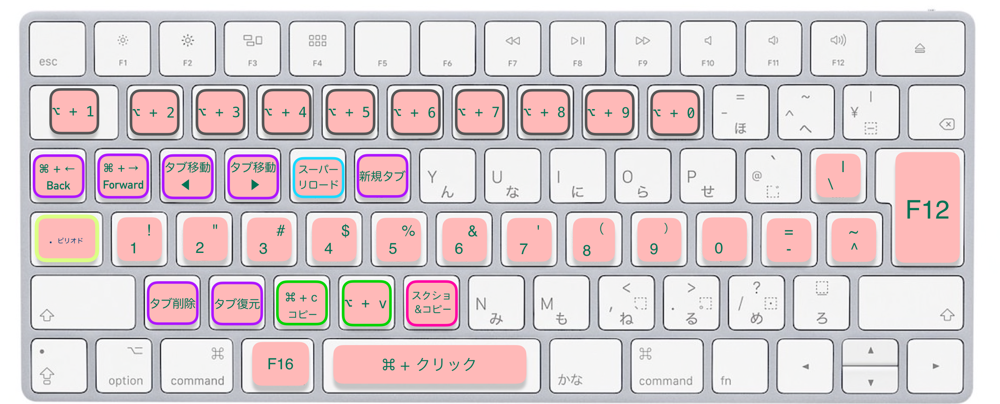

### 1. この割り当てについて

この割り当ては、日本語配列の特長である、スペース横の親指で押しやすいキーをレイヤーキーとして最大限に活かしたものとなっております。よく使用するキーを、ホームポジションからできるだけ離れずに入力できるようにしました。

キーの割り当てには次の2種類があります。
- キーを別のキーに変更する、単純な割り当て ・・・ ⭐️
- 特定のキーが押されている間だけ別のキーに変更する複雑な割り当て ・・・🛸

ここでは、🛸 の場合における ｢特定のキー｣ をレイヤーキーと呼びます。

今回は、親指に近い3つのキーをレイヤーキーとしています。
レイヤーキーとして使用するために、一旦シンプルな割り当てを挟んでいます。

#### Modification で シンプルな割り当て

##### 変更前の状態

Karabiner Elements の GUI を操作し、次のようにシンプルな割り当てを作成します。

##### 変更後の状態

今回のレイヤーキーとしたのは、赤枠で囲まれている箇所の F18、F16、F17 です。

---

#### F16のレイヤー

---

#### F17のレイヤー

---

### F18のレイヤー
